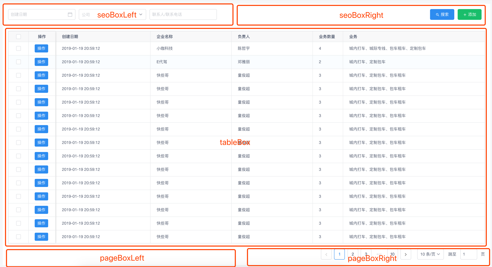

# Table表格

为了快速统一风格的搭建表格页面，所以对 iview 的组件进行二次开发组合的一个`XkTable`组件。

## slot 插槽

下图2-1介绍了该组件的效果图和 slot 分布及名称：



## 表格高度自动撑满

`tableBox` 这个 slot 有个返回值用来动态控制 table 的高度的值 。slot-scope="scope"  => scope.tableHeight 这个是 `tableBox`这个盒子的总高度。

示例：

 ```vue
  <template slot="tableBox" slot-scope="scope">
     <Table :height="scope.tableHeight" border :columns="tableTitle" :data="table"
            :loading="tableLoading"
            type="selection" size="small"></Table>
   </template>
 ```

